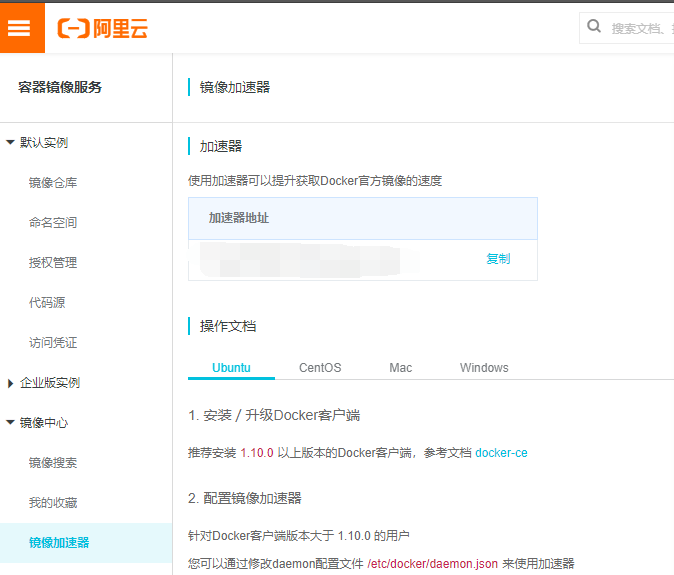

# docker

## 安装

```bash
# 更新
apt-get update
# 安装所需依赖
apt-get -y install apt-transport-https ca-certificates curl software-properties-common
# 安装 GPG 证书
curl -fsSL http://mirrors.aliyun.com/docker-ce/linux/ubuntu/gpg | sudo apt-key add -
# 新增数据源
add-apt-repository "deb [arch=amd64] http://mirrors.aliyun.com/docker-ce/linux/ubuntu $(lsb_release -cs) stable"
# 更新并安装 Docker CE
apt-get update && apt-get install -y docker-ce
```


## 配置加速器





